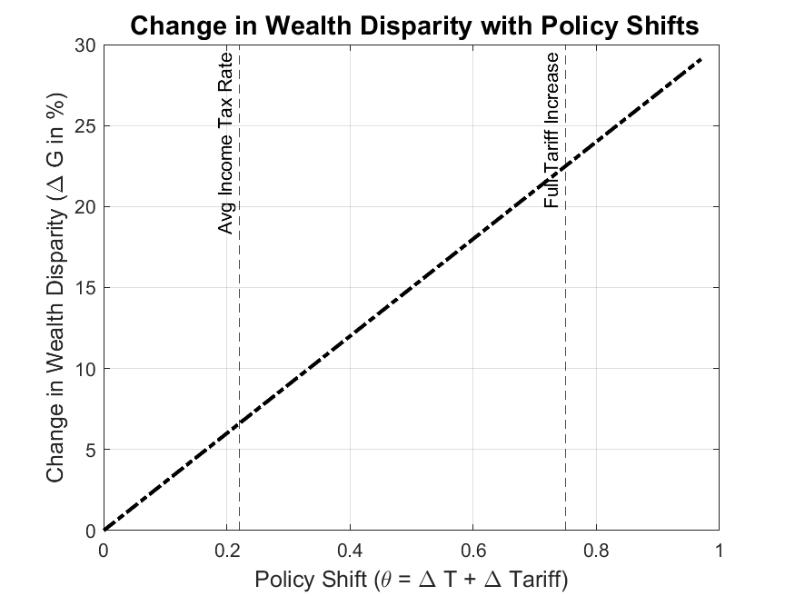

# Economic Policy Impact Simulation

This repository contains a MATLAB simulation that models the effects of policy changes—specifically increases in income tax and tariffs—on the following economic indicators:

- Gross Domestic Product (GDP)
- GDP per Capita
- Wealth Concentration (Top 10%)

## 📊 Overview

The simulation uses elasticity parameters to estimate the impact of policy shifts and visualizes:

- Change in GDP
- Change in GDP Per Capita
- Change in Wealth Disparity

## 🧠 Model Parameters

- **GDP (current)**: \$27.36 trillion  
- **Population**: 334.9 million  
- **Wealth Share (Top 10%)**: 60%  
- **Elasticities**:
  - Consumption: 0.6817
  - Investment: 0.207
  - Government Spending: 0.207
  - Wealth Elasticity: 0.5

- **Policy Shift Inputs**:
  - Tax Rate Increase: 22%
  - Tariff Increase: 75%
 
    
 
## 📈 Simulation Models

### **1. Change in GDP with Policy Shifts**

    

- The graph shows a **linear increase** in GDP as the policy shift parameter (sum of tax rate increase and tariff increase) rises.  
- At the **average income tax rate (0.22)**, there is a noticeable but moderate rise in GDP.  
- At the **full tariff increase (0.75)**, GDP has increased significantly.  
- This suggests that the modeled elasticity parameters predict that a combination of higher taxes and tariffs results in overall GDP growth.  

---

### **2. Change in GDP Per Capita with Policy Shifts**

    

- The **dashed-line plot** shows that GDP per capita also increases **linearly** with the policy shift.  
- This indicates that **economic growth is distributed across the population**, maintaining a proportional rise in GDP per person.  
- The same marked points (0.22 and 0.75) show how much per capita GDP increases as policy changes take effect.  

---

### **3. Change in Wealth Disparity with Policy Shifts**

    

- This graph shows a **steady increase in wealth disparity** as policy shifts occur.  
- The **top 10% wealth share grows proportionally** with GDP, suggesting that economic expansion benefits the wealthiest portion of the population more significantly.  
- Even at the lowest policy shift level, the wealth concentration of the top 10% **increases**, which indicates that policies may exacerbate wealth inequality rather than redistribute income evenly.  

---

## **Overall Interpretation**
- The model predicts **positive GDP and GDP per capita growth** with increasing taxation and tariffs.  
- However, **wealth disparity also grows**, suggesting that these policy changes disproportionately benefit the wealthiest individuals rather than reducing inequality.  
- This aligns with **elasticity assumptions** that capital accumulation and consumption drive wealth concentration more than redistribution mechanisms in the economy.  

--- 

## 📁 Files

- `policy_model.m`: Main MATLAB script
- `GDP_change.png`: Plot of GDP change with policy shift
- `GDP_per_capita.png`: Plot of GDP per capita with policy shift
- `Wealth_disparity.png`: Plot of change in wealth concentration

## ▶️ How to Run

1. Open `policy_model.m` in MATLAB.
2. Run the script to generate and save plots in PNG format.
3. View graphs in the project folder.

## 📌 Class

Mathematics for Economics

---

*Created for educational simulation and economic policy analysis.*
